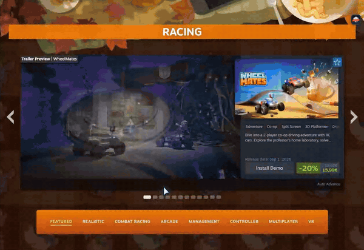
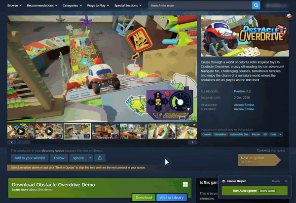
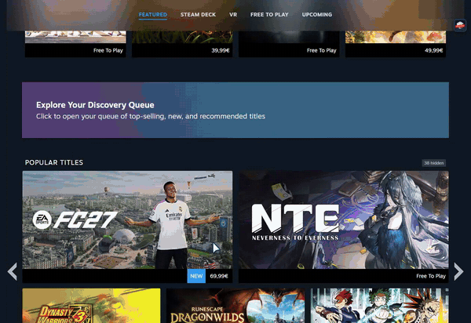
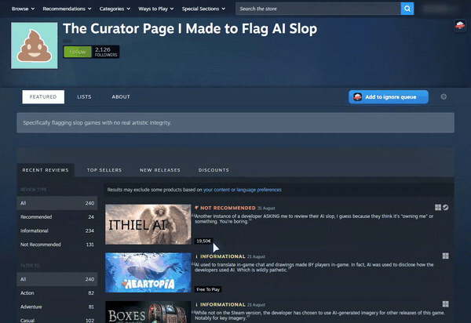

# Steam Ignore Like A Pro

  
  &nbsp;
  

A browser extension that lets you ignore Steam games straight from the storefront - no menus, no opening individual game pages.
**Steam Ignore Like A Pro** turns it into a single gesture or hotkey, available on every Steam Store page.

Website: [steamignorelikeapro.com](https://steamignorelikeapro.com)

  

## What's New

See [CHANGELOG.md](./CHANGELOG.md) for what changed in each release.

## What it does

- **One-Click Ignore** - Hold `Right-Click` + `Swipe Right` over any game capsule to ignore the game. This adds a red badge  on each appearance of the game on the page and requests Steam to **ignore** these titles.
- **Alternative Hotkeys** - Configure to hold `Ctrl`, `Shift`, or `Alt` + `Left-Click`, or to draw a circle, instead of swiping.
- **Already Played Mode** - Mark games you played on other platforms as **Already Played** by `swiping Left` or clicking. This adds a blue badge  and Steam stops suggesting these titles while **keeping** your recommendations relevant.
- **Un-Ignore One Game** - Hold `Right-Click` and draw a circle (either direction) or a quick zigzag over the capsule. The badge comes off and Steam un-ignores the game. This is applied as a real rollback.

## Why not just use Steam's built-in ignore?

Native ignore is missing from many widgets and requires multiple clicks. 
Steam also lacks an "Already Played" feature outside of the game's full store page, and offers no way to automate ignoring during feed browsing. 
This extension allows this.

## Additional Features

### Popup & History

- **Quick Settings** - Customize gestures or hotkeys, configure ignore modes to suit your browsing style, and toggle specific features or the entire extension directly from the popup.
- **Ignore History Tracking** - View your recently ignored game titles instantly from the extension popup.
- **Bulk Un-ignore** - The **Undo** button in the panel rolls back recent ignores without hunting down each store page: everything from the last N hours or days, or the last N titles. It also reaches games the per-game gesture can't, such as ones ignored in another tab or by the queue automators, and is paced by the same rate limiter as the ignores.

### Interface surface

The extension's settings/history interface can live in one of two places:

- **On the page** (default) - a small launcher docked in the top-right of every Steam Store page, so it works everywhere, including the Steam desktop client where the browser toolbar isn't available.
- **In the toolbar popup** - the classic browser action popup. Switch to it from the interface toggle in the settings. In this mode the on-page launcher steps aside to a faint beacon in the corner. (The toolbar popup is unavailable inside the Steam desktop client, so this mode is disabled there.)

**Escape hatch:** press **`Ctrl+Alt+Shift+I`** on any Steam Store page to force the interface back onto the page at any time.

### Automation Helpers

- **Classic Discovery Queue Helper** - Automate ignoring while browsing through your daily Discovery Queue. 
Configurable to automatically ignore games that meet your criteria (e.g., Mixed/Negative reviews, or every game), or ignore and scroll forward for you.

  

> ⚠️ **Sale rewards stay yours to earn.** During a Steam sale with Discovery Queue rewards, the queue helpers still ignore but leave Next to you until you've gone through one queue yourself.
>
> We don't recommend using versions below 1.3.1.

- **Game Genre/Category Discovery Queue Auto-Ignore** - Not limited to the 10 tags Steam lets you exclude. 
By navigating to a specific tag, genre, or category page (such as Racing or VR) and opening its Discovery Queue, you can run the automator to quickly ignore **all** games from that list, or only those with bad reviews.

  

- **Curator Ignore Queue** - Stage a whole curator's list into an ignore queue from the curator page, optionally filtered, and let the extension work through it at a measured pace. Jobs can be paused, resumed, or dropped while they run, and progress is visible in the interface.
On Chrome/Edge the queue keeps draining in the background with no Steam tab open; on Firefox it advances while a Steam Store page is open.

  

## Privacy

No tracking, no analytics, no external servers.  

- Runs exclusively on https://store.steampowered.com/*
- Your settings and ignore history are stored locally in `chrome.storage` and never leave your browser.
- API calls go directly to Steam's official endpoints.
- **No Steam API keys, passwords, or personal Steam data are stored or copied outside your browser.** It strictly uses your active session data.
- It does not send data to third-party servers, inject remote code, or use analytics.

See [PRIVACY.md](./PRIVACY.md) for the full privacy policy.

## Install

The extension is published on both stores - this is the recommended way to install it:

- **Chrome | Edge** - [Chrome Web Store](https://chromewebstore.google.com/detail/odammmlfgeicckclecklaidnogfibanj)
- **Firefox** - [Firefox Add-ons](https://addons.mozilla.org/firefox/addon/steam-ignore-like-a-pro/)

### From source

For development, or to run a build ahead of the store release:

1. Clone or download the repository.
2. Open a terminal in the project root and run `npm install`.
3. Run `npm run build` (or `node build.js`) to generate the `dist/` folders.

**Chrome | Edge**

1. Open *chrome://extensions* or *edge://extensions*
2. Turn on **Developer mode**
3. Click **Load unpacked**
4. Select the `dist/chromium` folder from the built project.

**Firefox**

1. Open *about:debugging#/runtime/this-firefox*
2. Click **Load Temporary Add-on**
3. Select the `manifest.json` file located inside the `dist/firefox` folder.

## FAQ

- **Why does an ignored game stay on the page?**  
The extension marks it at once (IGNORED badge, blurred cover), but Steam only drops ignored games from its lists when it rebuilds them, and its caching can lag behind.

- **Why don't my ignores fire instantly?**  
Ignores are placed in a queue and sent one at a time at a fixed pace, to keep the load on Steam's servers low. The badge appears immediately; the request follows shortly after.

- **Is this compliant with Steam's policies?**  
Section 4.C of the [Steam Subscriber Agreement](https://store.steampowered.com/subscriber_agreement/) prohibits scripts, bots and other non-human-controlled systems for interacting with Steam, including earning rewards or progress without genuine user input. The gestures and hotkeys act once per action you take. The queue helpers, the curator queue and bulk undo do act on your behalf: the queue helpers ignore games for you and can move through a queue, and one confirmation in the curator queue or bulk undo sends many requests. The extension never earns sale rewards for you — during a sale it leaves the queue to you until you have earned them yourself. Every request uses your existing signed-in session and the same endpoints Steam's own buttons use, and passes through one shared rate limiter. The extension is not made or endorsed by Valve, and only Valve can say how its terms apply to your account, so use it at your own discretion.

- **Can I undo an ignore?**  
Yes. Use the **Undo** button in the extension's panel to un-ignore the last N games or everything from a recent stretch of time. Since Steam Ignore Like A Pro applies a standard Steam ignore, you can also remove it anytime from the game's own store page.

- **Does it work with non-English Steam?**  
Yes. The extension interacts with page elements and structural DOM classes, not localized text labels, so language settings do not affect it.

## Project structure

- `platform/` - MV3 manifests, one per target (`chromium/manifest.json`, `firefox/manifest.json`).
- `build.js` - Node script to compile platform-specific distributions (Chromium/Firefox).
- `styles/styles.css` - Global CSS for injected badges and tooltips.
- `ui/` - Contains the popup interface (HTML, CSS, JS).
- `assets/` - Extension icons and other media files.
- `src/utils.js`, `src/game-name.js` - Shared content-script utilities, the Steam API calls, and game name extraction.
- `src/manual-ignore/` - Modules for handling swipe gestures, hotkeys, and rendering badges on the storefront.
- `src/discovery-queue/` - The automator panel in Steam's Discovery Queue window (tag, genre and category queues).
- `src/explore-queue/` - The Classic Discovery Queue helper (the one-game-at-a-time queue pages).
- `src/curator/` - Curator list enumeration, the ignore queue store, and the drainer that works through it.
- `src/widget/` - The on-page interface launcher and its panel.
- `src/background.js` - Chromium service worker that drains the queue with no Steam tab open.
- `src/gate.js` - Shared ignore-rate governor every request passes through.
- `src/steam-palette.js` - Steam's review-score colours in one table, read by both queue classifiers.
- `src/ignore-log.js`, `src/undo-service.js` - Ignore journal and the undo path built on it.
- `PRIVACY.md` - Privacy policy for users and the Chrome Web Store.

## Notes
- Steam Ignore Like A Pro is not affiliated with, endorsed by, or sponsored by Valve Corporation or Steam.
- The ignore action cannot be applied to capsule elements that represent bundles of multiple games. To ignore them, you must visit the bundle's store page and swipe or click to ignore each game individually.

## Testing

See [TESTING.md](./TESTING.md) for the full test suite overview, setup instructions, and per-module coverage.

## License

GNU General Public License v3.0 or later (`GPL-3.0-or-later`) - see [LICENSE](./LICENSE).

Releases up to and including v1.1 were distributed under the Mozilla Public License 2.0; that text is kept at [LICENSE.MPL](./LICENSE.MPL) for reference. Version 1.2 onward is GPL-3.0-or-later.

## Disclaimer

This extension is provided "as is", without warranty of any kind. Use it at your own risk. Automated and bulk actions (the queue helpers, the curator ignore queue, bulk undo) interact with Steam on your behalf — you are responsible for your own account and for respecting the [Steam Subscriber Agreement](https://store.steampowered.com/subscriber_agreement/). The authors are not liable for any consequences arising from its use.